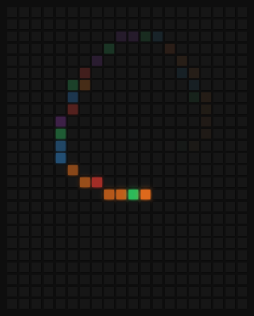

# Hoverboard - a simple DOM manipulation exercise

This is a cool little effect. Hover over the little boxes to leave a trail of random colors. It uses CSS transitions for the fade out effect. It is a simple DOM manipulation exercise that I did, folowing along with a tutorial.

### Links

- Solution URL: [click here](https://github.com/climaco-sarmiento/hoverboard)
- Live Site URL: [click here](https://climaco-sarmiento.github.io/hoverboard/)

### Screenshot

## Author

- Website - [Ubaid Khalid](https://www.ubaidkhalid.dev)
- LinkedIn - [Ubaid Khalid](https://www.linkedin.com/in/ubaid-khalid-dev/)
